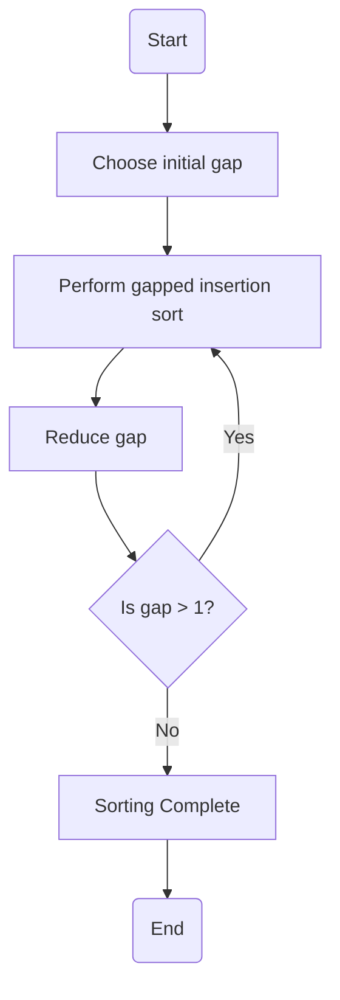

# Shell Sort

## Introduction
Shell Sort is an **in-place comparison-based sorting algorithm** that generalizes **Insertion Sort** to allow the exchange of items that are far apart. It **reduces the total number of shifts and swaps** by sorting elements at a specific gap and gradually reducing the gap to 1.

## Why Shell Sort?
- **Insertion Sort works well only for nearly sorted arrays**. Shell Sort helps improve it by **starting with larger gaps**.
- Instead of moving one element at a time, Shell Sort moves elements **separated by a gap**.
- It helps **reduce the number of shifts and swaps** compared to Insertion Sort.

## Algorithm Steps (Step-by-Step Breakdown)
1. **Choose a gap sequence**: Start with `gap = n/2`, then reduce it in each step (`gap = gap/2`).
2. **Perform gapped insertion sort**:
   - Compare elements that are `gap` distance apart.
   - If the previous element is greater, swap them.
   - Continue this process for all elements.
3. **Reduce the gap**: Repeat the above process with smaller gaps (`gap = gap / 2`).
4. **Final Pass with gap = 1**: The array is fully sorted like **Insertion Sort**.

---

## Flowchart


---

## C Implementation (Detailed Explanation)
```c
#include <stdio.h>

void shellSort(int A[], int n) {
    int gap, i, j;
    for (gap = n / 2; gap >= 1; gap /= 2) {  // Reduce gap in each iteration
        for (i = gap; i < n; i++) {  // Start sorting with the current gap
            int temp = A[i];  // Store the current element
            j = i - gap;
            while (j >= 0 && A[j] > temp) {  // Compare elements gap apart
                A[j + gap] = A[j];  // Shift element to the right
                j -= gap;
            }
            A[j + gap] = temp;  // Place the element at its correct position
        }
    }
}

int main() {
    int A[] = {9, 8, 3, 7, 5, 6, 4, 1};
    int n = sizeof(A) / sizeof(A[0]);
    shellSort(A, n);
    for (int i = 0; i < n; i++) {
        printf("%d ", A[i]);  // Print sorted array
    }
    return 0;
}
```

---

## Example Walkthrough (Step-by-Step Execution)
### Given Input:
`[9, 8, 3, 7, 5, 6, 4, 1]`

### **Step 1: Gap = 4**
Elements compared: `(A[0], A[4]), (A[1], A[5]), (A[2], A[6]), (A[3], A[7])`
- Swap if left element > right element
- After this step: `[5, 6, 3, 1, 9, 8, 4, 7]`

### **Step 2: Gap = 2**
Elements compared: `(A[0], A[2]), (A[1], A[3]), (A[4], A[6]), (A[5], A[7])`
- Swap elements again to refine order
- After this step: `[3, 1, 5, 6, 4, 7, 9, 8]`

### **Step 3: Gap = 1 (Final Pass as Insertion Sort)**
- The array is almost sorted, small adjustments are made.
- **Final Output:** `[1, 3, 4, 5, 6, 7, 8, 9]`

---

## Key Points
✅ **Better than Insertion Sort for larger datasets** because fewer shifts are required.
✅ **Works well for medium-sized arrays** but **not stable** (relative order of equal elements may change).
✅ **Time Complexity:**
   - **Best Case:** `O(n log n)`
   - **Worst Case:** `O(n²)` (depends on gap sequence)
✅ **Space Complexity:** `O(1)` (in-place sorting, no extra space needed)
✅ **Used in hybrid sorting algorithms** to optimize performance.

---

## Conclusion
Shell Sort is a powerful enhancement over **Insertion Sort**, making sorting faster by comparing elements at **gaps** rather than adjacent positions. 🚀

---

